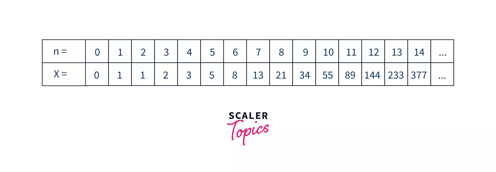
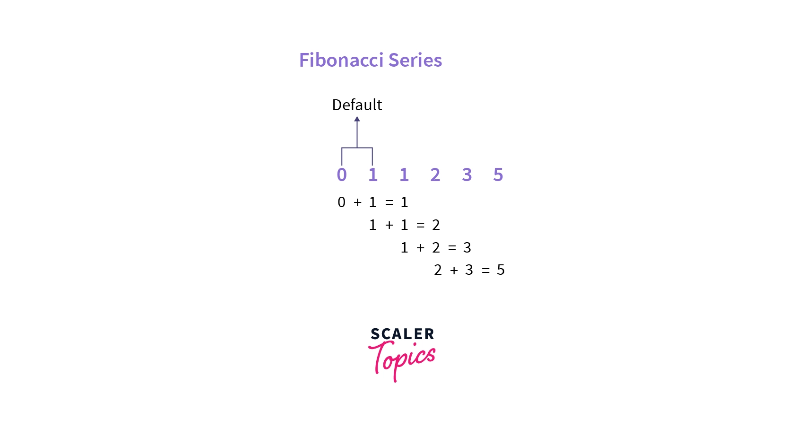
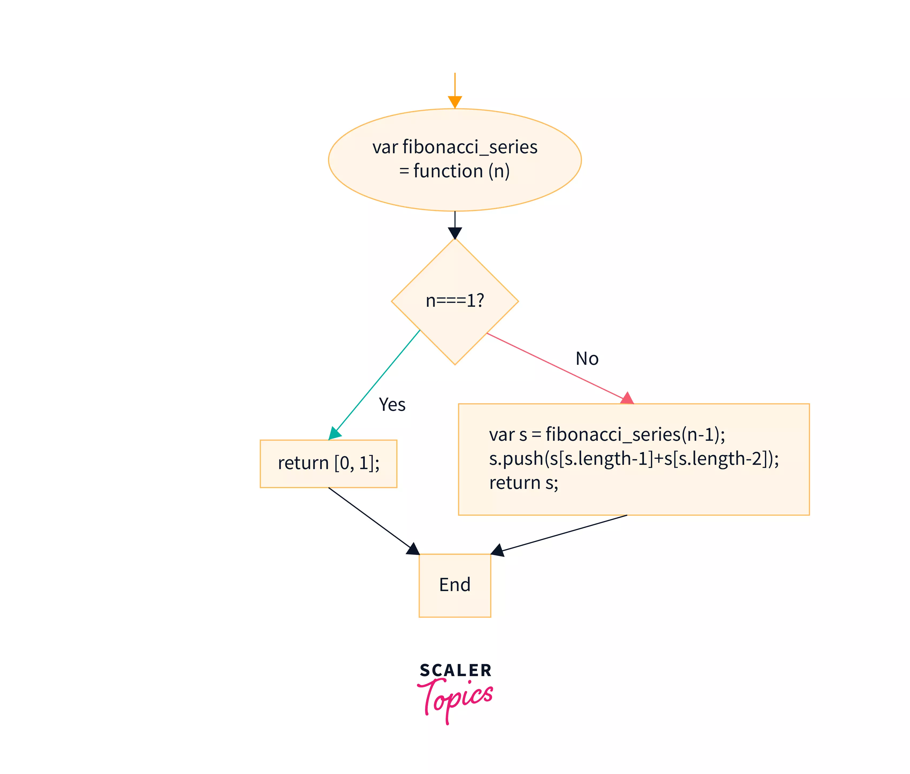
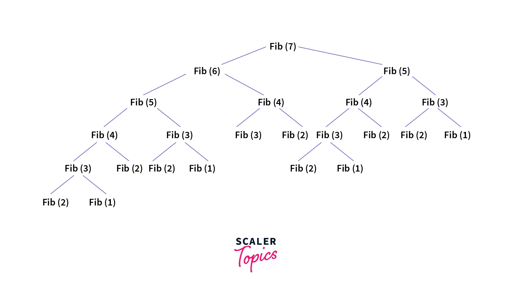
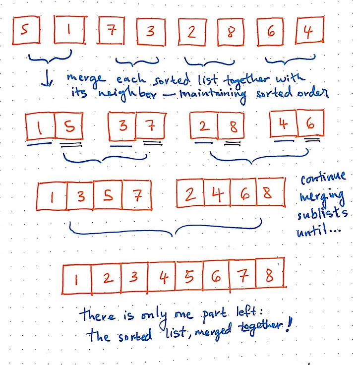
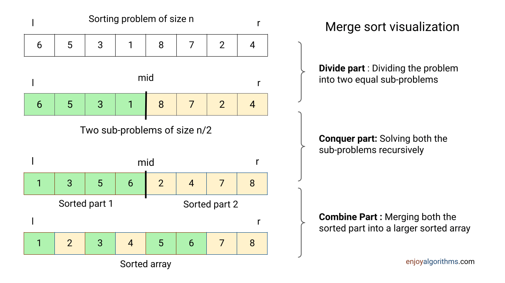

# Recursion
`Description`: exercises to practice recursion and iteration

1. The Fibonacci Sequence, which sums each number with the one before it, is a great example of a problem that can be solved recursively. 
`Fibonacci structures`:

2. Merge sort:  Each sub piece has its own numbers and you keep breaking and breaking until there is one piece each other, with their own number

